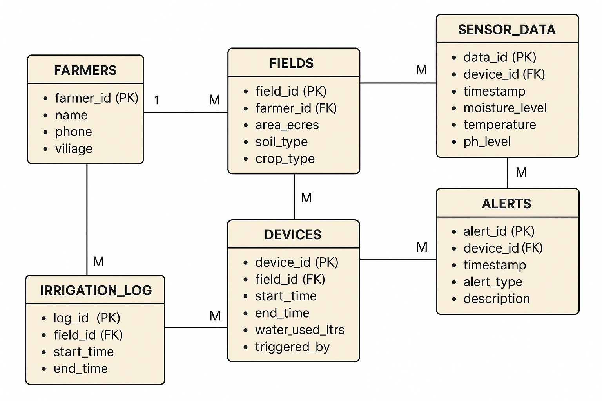

# 🌾 Smart Farming System - Database Project

## 📘 Introduction

The **Smart Farming System** is a database project designed to manage and analyze agricultural data collected from IoT-based smart devices.  
It stores and monitors information about farmers, their fields, soil data, irrigation logs, and real-time sensor readings.  
The goal of this project is to automate farm monitoring and improve decision-making through efficient database design.

---

## 🧩 ER Diagram

## 

## 🧱 Database Schema

### 1️⃣ **FARMERS**

Stores information about registered farmers.

| Column Name | Data Type    | Constraints | Description               |
| ----------- | ------------ | ----------- | ------------------------- |
| farmer_id   | INT          | PRIMARY KEY | Unique ID for each farmer |
| name        | VARCHAR(100) | NOT NULL    | Farmer’s full name        |
| phone       | VARCHAR(15)  | UNIQUE      | Contact number            |
| village     | VARCHAR(100) | NOT NULL    | Village name              |

---

### 2️⃣ **FIELDS**

Each farmer can have multiple fields registered for monitoring.

| Column Name | Data Type    | Constraints                               | Description                            |
| ----------- | ------------ | ----------------------------------------- | -------------------------------------- |
| field_id    | INT          | PRIMARY KEY                               | Unique ID for each field               |
| farmer_id   | INT          | FOREIGN KEY REFERENCES FARMERS(farmer_id) | Links field to farmer                  |
| area_acres  | DECIMAL(5,2) | NOT NULL                                  | Area of field in acres                 |
| soil_type   | VARCHAR(50)  |                                           | Type of soil (e.g., Clay, Loam, Sandy) |
| crop_type   | VARCHAR(50)  |                                           | Crop being cultivated                  |

---

### 3️⃣ **DEVICES**

Represents IoT devices used in each field for automation.

| Column Name     | Data Type    | Constraints                             | Description                                  |
| --------------- | ------------ | --------------------------------------- | -------------------------------------------- |
| device_id       | INT          | PRIMARY KEY                             | Unique device ID                             |
| field_id        | INT          | FOREIGN KEY REFERENCES FIELDS(field_id) | Device installed in which field              |
| start_time      | DATETIME     |                                         | Device activation time                       |
| end_time        | DATETIME     |                                         | Device deactivation time                     |
| water_used_ltrs | DECIMAL(7,2) |                                         | Amount of water used (liters)                |
| triggered_by    | VARCHAR(50)  |                                         | Source that triggered device (manual/sensor) |

---

### 4️⃣ **SENSOR_DATA**

Stores the readings collected from IoT sensors.

| Column Name    | Data Type    | Constraints                               | Description                 |
| -------------- | ------------ | ----------------------------------------- | --------------------------- |
| data_id        | INT          | PRIMARY KEY                               | Unique reading ID           |
| device_id      | INT          | FOREIGN KEY REFERENCES DEVICES(device_id) | Device that collected data  |
| timestamp      | DATETIME     |                                           | Time when data was recorded |
| moisture_level | DECIMAL(5,2) |                                           | Soil moisture percentage    |
| temperature    | DECIMAL(5,2) |                                           | Field temperature (°C)      |
| ph_level       | DECIMAL(4,2) |                                           | Soil pH value               |

---

### 5️⃣ **ALERTS**

Generated automatically when abnormal conditions are detected.

| Column Name | Data Type    | Constraints                               | Description                                   |
| ----------- | ------------ | ----------------------------------------- | --------------------------------------------- |
| alert_id    | INT          | PRIMARY KEY                               | Unique alert ID                               |
| device_id   | INT          | FOREIGN KEY REFERENCES DEVICES(device_id) | Which device triggered the alert              |
| timestamp   | DATETIME     |                                           | Time when alert occurred                      |
| alert_type  | VARCHAR(50)  |                                           | Type of alert (Low Moisture, High Temp, etc.) |
| description | VARCHAR(255) |                                           | Details about the issue                       |

---

### 6️⃣ **IRRIGATION_LOG**

Tracks irrigation sessions for each field.

| Column Name | Data Type | Constraints                             | Description              |
| ----------- | --------- | --------------------------------------- | ------------------------ |
| log_id      | INT       | PRIMARY KEY                             | Unique irrigation log ID |
| field_id    | INT       | FOREIGN KEY REFERENCES FIELDS(field_id) | Field being irrigated    |
| start_time  | DATETIME  |                                         | Start time of irrigation |
| end_time    | DATETIME  |                                         | End time of irrigation   |

---

## 🧮 SQL Table Creation Script

```sql
CREATE TABLE FARMERS (
    farmer_id INT PRIMARY KEY,
    name VARCHAR(100) NOT NULL,
    phone VARCHAR(15) UNIQUE,
    village VARCHAR(100) NOT NULL
);

CREATE TABLE FIELDS (
    field_id INT PRIMARY KEY,
    farmer_id INT,
    area_acres DECIMAL(5,2) NOT NULL,
    soil_type VARCHAR(50),
    crop_type VARCHAR(50),
    FOREIGN KEY (farmer_id) REFERENCES FARMERS(farmer_id)
);

CREATE TABLE DEVICES (
    device_id INT PRIMARY KEY,
    field_id INT,
    start_time DATETIME,
    end_time DATETIME,
    water_used_ltrs DECIMAL(7,2),
    triggered_by VARCHAR(50),
    FOREIGN KEY (field_id) REFERENCES FIELDS(field_id)
);

CREATE TABLE SENSOR_DATA (
    data_id INT PRIMARY KEY,
    device_id INT,
    timestamp DATETIME,
    moisture_level DECIMAL(5,2),
    temperature DECIMAL(5,2),
    ph_level DECIMAL(4,2),
    FOREIGN KEY (device_id) REFERENCES DEVICES(device_id)
);

CREATE TABLE ALERTS (
    alert_id INT PRIMARY KEY,
    device_id INT,
    timestamp DATETIME,
    alert_type VARCHAR(50),
    description VARCHAR(255),
    FOREIGN KEY (device_id) REFERENCES DEVICES(device_id)
);

CREATE TABLE IRRIGATION_LOG (
    log_id INT PRIMARY KEY,
    field_id INT,
    start_time DATETIME,
    end_time DATETIME,
    FOREIGN KEY (field_id) REFERENCES FIELDS(field_id)
);
```
